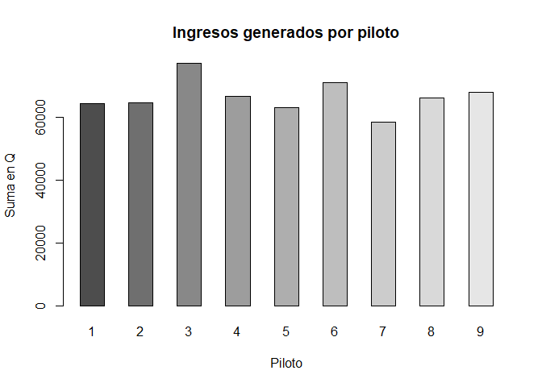
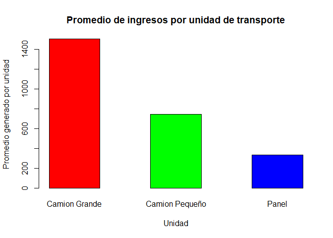
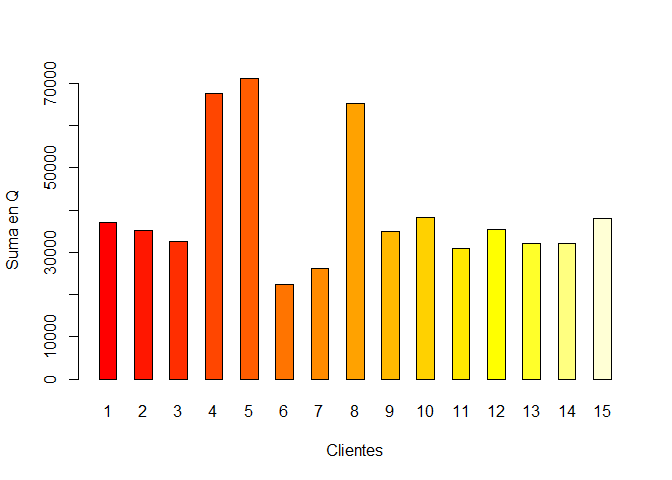
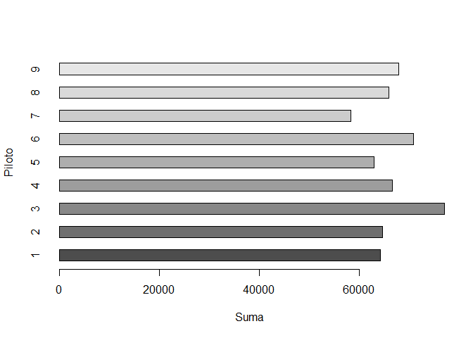
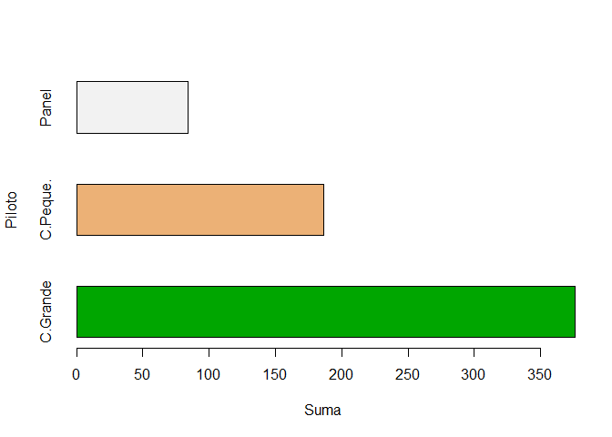

Reporte Transportes
================
Diego Quan
8/18/2019

## Personal

En el estado actual de la empresa, sería beneficioso la contratación de
más personal ya que se puede en la gráfica que cada uno de los empleados
contribuye considerablemente al total de ganancias de la empresa. Esto
nos dice que añadir más empleados podría aumentarlas, pero hay que tener
en mente el costo de operación, ya que esto podría requerir adquirir más
unidades de transporte.

<table class="table table-condensed">

<thead>

<tr>

<th style="text-align:left;">

</th>

<th style="text-align:right;">

Group.1

</th>

<th style="text-align:right;">

x

</th>

</tr>

</thead>

<tbody>

<tr>

<td style="text-align:left;">

3

</td>

<td style="text-align:right;">

Fernando Mariano Berrio

</td>

<td style="text-align:right;">

77097.25

</td>

</tr>

<tr>

<td style="text-align:left;">

6

</td>

<td style="text-align:right;">

Ismael Rodero Monteagudo

</td>

<td style="text-align:right;">

70936.50

</td>

</tr>

<tr>

<td style="text-align:left;">

9

</td>

<td style="text-align:right;">

Pedro Alvarez Parejo

</td>

<td style="text-align:right;">

67940.50

</td>

</tr>

<tr>

<td style="text-align:left;">

4

</td>

<td style="text-align:right;">

Hector Aragones Frutos

</td>

<td style="text-align:right;">

66645.25

</td>

</tr>

<tr>

<td style="text-align:left;">

8

</td>

<td style="text-align:right;">

Luis Jaime Urbano

</td>

<td style="text-align:right;">

65992.25

</td>

</tr>

<tr>

<td style="text-align:left;">

2

</td>

<td style="text-align:right;">

Felipe Villatoro

</td>

<td style="text-align:right;">

64626.50

</td>

</tr>

<tr>

<td style="text-align:left;">

1

</td>

<td style="text-align:right;">

Angel Valdez Alegria

</td>

<td style="text-align:right;">

64307.50

</td>

</tr>

<tr>

<td style="text-align:left;">

5

</td>

<td style="text-align:right;">

Hector Giron

</td>

<td style="text-align:right;">

62955.25

</td>

</tr>

<tr>

<td style="text-align:left;">

7

</td>

<td style="text-align:right;">

Juan Francisco Portillo Gomez

</td>

<td style="text-align:right;">

58347.25

</td>

</tr>

</tbody>

</table>

<!-- -->

## Unidades de transporte

La respuesta a su pregunta si se requerirá adquirir más unidades de
transporte dependerá de la decisión que vaya a tomar en respecto a los
pilots. Si contrata a más pilotos deberá adquirir más unidades de
transporte. El número de unidades deberá ser proporcional. La unidad que
genera la mayor cantidad de ingresos es el Camión Grande.

<table class="table table-condensed">

<thead>

<tr>

<th style="text-align:right;">

Unidad

</th>

<th style="text-align:right;">

PromedioGenerado

</th>

</tr>

</thead>

<tbody>

<tr>

<td style="text-align:right;">

Camion Grande

</td>

<td style="text-align:right;">

1504.4310

</td>

</tr>

<tr>

<td style="text-align:right;">

Camion Pequeño

</td>

<td style="text-align:right;">

745.8860

</td>

</tr>

<tr>

<td style="text-align:right;">

Panel

</td>

<td style="text-align:right;">

335.8956

</td>

</tr>

</tbody>

</table>

<!-- -->

## Satisfacción de los clientes con la tarifa

En base a los datos, se puede inferir que los clientes estan satisfechos
con las tarifas de la empresa. El único cliente que ha tenido
devoluciones es el bar EL GALLO NEGRO, se asume que las devoluciones por
esa razón.

<table class="table table-condensed">

<thead>

<tr>

<th style="text-align:right;">

COD\_VIAJE

</th>

<th style="text-align:right;">

CLIENTE

</th>

<th style="text-align:right;">

MOTIVO

</th>

<th style="text-align:right;">

Q

</th>

</tr>

</thead>

<tbody>

<tr>

<td style="text-align:right;">

10000009

</td>

<td style="text-align:right;">

EL GALLO NEGRO

</td>

<td style="text-align:right;">

Devolucion

</td>

<td style="text-align:right;">

400.25

</td>

</tr>

<tr>

<td style="text-align:right;">

10000047

</td>

<td style="text-align:right;">

EL GALLO NEGRO

</td>

<td style="text-align:right;">

Devolucion

</td>

<td style="text-align:right;">

90.50

</td>

</tr>

<tr>

<td style="text-align:right;">

10000065

</td>

<td style="text-align:right;">

EL GALLO NEGRO

</td>

<td style="text-align:right;">

Devolucion

</td>

<td style="text-align:right;">

281.50

</td>

</tr>

<tr>

<td style="text-align:right;">

10000110

</td>

<td style="text-align:right;">

EL GALLO NEGRO

</td>

<td style="text-align:right;">

Devolucion

</td>

<td style="text-align:right;">

174.00

</td>

</tr>

<tr>

<td style="text-align:right;">

10000124

</td>

<td style="text-align:right;">

EL GALLO NEGRO

</td>

<td style="text-align:right;">

Devolucion

</td>

<td style="text-align:right;">

404.50

</td>

</tr>

<tr>

<td style="text-align:right;">

10000135

</td>

<td style="text-align:right;">

EL GALLO NEGRO

</td>

<td style="text-align:right;">

Devolucion

</td>

<td style="text-align:right;">

320.00

</td>

</tr>

</tbody>

</table>

## Robo de pilotos

En lo que concierne a los robos de parte de sus pilotos, considero que
ellos no estan cometiendo un crimen en contra de ustedes. Esto lo
inferimos a traves de la cantidad de faltantes por piloto mostrada
abajo. Todos estan en un promedio bastante cercano, al menos que muchos
de sus pilotos les esten robando, lo cual es una opción a considerar

<table class="table table-condensed">

<thead>

<tr>

<th style="text-align:right;">

Piloto

</th>

<th style="text-align:right;">

\#\_Faltantes

</th>

</tr>

</thead>

<tbody>

<tr>

<td style="text-align:right;">

Angel Valdez Alegria

</td>

<td style="text-align:right;">

65

</td>

</tr>

<tr>

<td style="text-align:right;">

Felipe Villatoro

</td>

<td style="text-align:right;">

59

</td>

</tr>

<tr>

<td style="text-align:right;">

Fernando Mariano Berrio

</td>

<td style="text-align:right;">

78

</td>

</tr>

<tr>

<td style="text-align:right;">

Hector Aragones Frutos

</td>

<td style="text-align:right;">

70

</td>

</tr>

<tr>

<td style="text-align:right;">

Hector Giron

</td>

<td style="text-align:right;">

60

</td>

</tr>

<tr>

<td style="text-align:right;">

Ismael Rodero Monteagudo

</td>

<td style="text-align:right;">

71

</td>

</tr>

<tr>

<td style="text-align:right;">

Juan Francisco Portillo Gomez

</td>

<td style="text-align:right;">

58

</td>

</tr>

<tr>

<td style="text-align:right;">

Luis Jaime Urbano

</td>

<td style="text-align:right;">

56

</td>

</tr>

<tr>

<td style="text-align:right;">

Pedro Alvarez Parejo

</td>

<td style="text-align:right;">

71

</td>

</tr>

</tbody>

</table>

## Estrategia a tomar

Considero que la estrategia que la empresa debe de utilizar es una
expansión controlada. Contratar pilotos aptos y a medida que incremente
la cantidad de estos, incrementar la cantidad de unidades de transporte.
Al utilizar esta estrategia se debe de asegurar que los nuevos pilotos
no cometan robo o sean competentes/eficientes.

## Clientes más importantes

continuación se encuentra una gráfica con su respectiva tabla con la
paridad de PARETO de sus clientes.

<table class="table table-condensed">

<thead>

<tr>

<th style="text-align:right;">

Group.1

</th>

<th style="text-align:right;">

x

</th>

</tr>

</thead>

<tbody>

<tr>

<td style="text-align:right;">

ABARROTERIA EBENEZER

</td>

<td style="text-align:right;">

37129.00

</td>

</tr>

<tr>

<td style="text-align:right;">

BAR LA OFICINA

</td>

<td style="text-align:right;">

35163.50

</td>

</tr>

<tr>

<td style="text-align:right;">

CHICHARRONERIA EL RICO COLESTEROL

</td>

<td style="text-align:right;">

32456.25

</td>

</tr>

<tr>

<td style="text-align:right;">

EL GALLO NEGRO

</td>

<td style="text-align:right;">

67555.50

</td>

</tr>

<tr>

<td style="text-align:right;">

EL PINCHE OBELISCO

</td>

<td style="text-align:right;">

71079.00

</td>

</tr>

<tr>

<td style="text-align:right;">

HOSPITAL LAS AMERICAS

</td>

<td style="text-align:right;">

22486.00

</td>

</tr>

<tr>

<td style="text-align:right;">

HOSPITAL ROOSEVELT

</td>

<td style="text-align:right;">

26275.75

</td>

</tr>

<tr>

<td style="text-align:right;">

POLLO PINULITO

</td>

<td style="text-align:right;">

65105.50

</td>

</tr>

<tr>

<td style="text-align:right;">

SPORTA, S.A.

</td>

<td style="text-align:right;">

34984.25

</td>

</tr>

<tr>

<td style="text-align:right;">

TAQUERIA EL CHINITO

</td>

<td style="text-align:right;">

38274.00

</td>

</tr>

<tr>

<td style="text-align:right;">

TAQUERIA EL CHINITO

</td>

<td style="text-align:right;">

30861.50

</td>

</tr>

<tr>

<td style="text-align:right;">

TIENDA LA BENDICION

</td>

<td style="text-align:right;">

35338.00

</td>

</tr>

<tr>

<td style="text-align:right;">

UBIQUO LABS

</td>

<td style="text-align:right;">

32125.75

</td>

</tr>

<tr>

<td style="text-align:right;">

UBIQUO LABS

</td>

<td style="text-align:right;">

32125.00

</td>

</tr>

<tr>

<td style="text-align:right;">

UNIVERSIDAD FRANCISCO MARROQUIN

</td>

<td style="text-align:right;">

37889.25

</td>

</tr>

</tbody>

</table>

<!-- -->

## Pilotos más productivos

El piloto más productivo es Fernando Mariano Berrio, siguiendole Ismael
Rodero Monteaguado

<table class="table table-condensed">

<thead>

<tr>

<th style="text-align:right;">

Group.1

</th>

<th style="text-align:right;">

x

</th>

</tr>

</thead>

<tbody>

<tr>

<td style="text-align:right;">

Angel Valdez Alegria

</td>

<td style="text-align:right;">

64307.50

</td>

</tr>

<tr>

<td style="text-align:right;">

Felipe Villatoro

</td>

<td style="text-align:right;">

64626.50

</td>

</tr>

<tr>

<td style="text-align:right;">

Fernando Mariano Berrio

</td>

<td style="text-align:right;">

77097.25

</td>

</tr>

<tr>

<td style="text-align:right;">

Hector Aragones Frutos

</td>

<td style="text-align:right;">

66645.25

</td>

</tr>

<tr>

<td style="text-align:right;">

Hector Giron

</td>

<td style="text-align:right;">

62955.25

</td>

</tr>

<tr>

<td style="text-align:right;">

Ismael Rodero Monteagudo

</td>

<td style="text-align:right;">

70936.50

</td>

</tr>

<tr>

<td style="text-align:right;">

Juan Francisco Portillo Gomez

</td>

<td style="text-align:right;">

58347.25

</td>

</tr>

<tr>

<td style="text-align:right;">

Luis Jaime Urbano

</td>

<td style="text-align:right;">

65992.25

</td>

</tr>

<tr>

<td style="text-align:right;">

Pedro Alvarez Parejo

</td>

<td style="text-align:right;">

67940.50

</td>

</tr>

</tbody>

</table>

<!-- -->

## Unidades más productivas

Finalmente las unidades de transporte más productivas son los camiones
grandes, seguidos de los pequeños. Básicamente es en orden de tamaño de
la unidad. <!-- -->
