Lab10
================
Diego Quan
11/2/2019

## Manipulación de datos

``` r
df_movies <- read_csv('movies.csv')
```

    ## Warning: Missing column names filled in: 'X1' [1]

    ## Parsed with column specification:
    ## cols(
    ##   X1 = col_double(),
    ##   budget = col_double(),
    ##   id = col_double(),
    ##   imdb_id = col_character(),
    ##   original_language = col_character(),
    ##   original_title = col_character(),
    ##   popularity = col_double(),
    ##   release_year = col_double(),
    ##   release_date = col_character(),
    ##   revenue = col_double(),
    ##   runtime = col_double(),
    ##   title = col_character(),
    ##   vote_average = col_double(),
    ##   vote_count = col_double()
    ## )

``` r
df_ratings <- read_csv('ratings.csv')
```

    ## Warning: Missing column names filled in: 'X1' [1]

    ## Parsed with column specification:
    ## cols(
    ##   X1 = col_double(),
    ##   userId = col_double(),
    ##   movieId = col_double(),
    ##   rating = col_double(),
    ##   timestamp = col_double()
    ## )

``` r
new_ratings <- df_ratings %>% na.omit()
new_movies <- df_movies %>% na.omit()

agg_ratings <- aggregate(rating~movieId, new_ratings, FUN=mean)
names(agg_ratings)[1] <- 'id'
app_movies <- merge(new_movies, agg_ratings[, c("id", "rating")], by="id")
```

## 1\. Detalle de datos

``` r
skim(app_movies)
```

    ## Skim summary statistics
    ##  n obs: 13311 
    ##  n variables: 15 
    ## 
    ## -- Variable type:character ---------------------------------------------------------------------------------------------------------------
    ##           variable missing complete     n min max empty n_unique
    ##            imdb_id       0    13311 13311   9   9     0    13304
    ##  original_language       0    13311 13311   2   2     0       74
    ##     original_title       0    13311 13311   1 104     0    13100
    ##       release_date       0    13311 13311   6   8     0     8201
    ##              title       0    13311 13311   1  88     0    12962
    ## 
    ## -- Variable type:numeric -----------------------------------------------------------------------------------------------------------------
    ##      variable missing complete     n          mean           sd     p0
    ##        budget       0    13311 13311 4383511.57         1.8e+07    0  
    ##            id       0    13311 13311   1e+05       110286.53      11  
    ##    popularity       0    13311 13311       3.04         7.24       0  
    ##        rating       0    13311 13311       3.06         0.72       0.5
    ##  release_year       0    13311 13311    1992.58        23.2     1900  
    ##       revenue       0    13311 13311       1.2e+07  7e+07          0  
    ##       runtime       0    13311 13311      94.77        37.81       0  
    ##  vote_average       0    13311 13311       5.66         1.86       0  
    ##    vote_count       0    13311 13311     118.64       532.98       0  
    ##            X1       0    13311 13311    6759.33      3949.78       1  
    ##       p25      p50       p75         p100     hist
    ##      0        0         0         3.8e+08 <U+2587><U+2581><U+2581><U+2581><U+2581><U+2581><U+2581><U+2581>
    ##  25503    56325    145207    462788       <U+2587><U+2583><U+2582><U+2581><U+2581><U+2581><U+2581><U+2581>
    ##      0.42     1.19      3.79    547.49    <U+2587><U+2581><U+2581><U+2581><U+2581><U+2581><U+2581><U+2581>
    ##      2.69     3.15      3.5       5       <U+2581><U+2581><U+2582><U+2585><U+2587><U+2587><U+2582><U+2581>
    ##   1980     2001      2010      2018       <U+2581><U+2581><U+2581><U+2581><U+2582><U+2582><U+2583><U+2587>
    ##      0        0         0         2.1e+09 <U+2587><U+2581><U+2581><U+2581><U+2581><U+2581><U+2581><U+2581>
    ##     86       95       107      1140       <U+2587><U+2581><U+2581><U+2581><U+2581><U+2581><U+2581><U+2581>
    ##      5        6         6.8      10       <U+2582><U+2581><U+2581><U+2583><U+2587><U+2587><U+2582><U+2581>
    ##      3       10        35     12269       <U+2587><U+2581><U+2581><U+2581><U+2581><U+2581><U+2581><U+2581>
    ##   3332.5   6695     10173.5   13686       <U+2587><U+2587><U+2587><U+2587><U+2587><U+2587><U+2587><U+2587>

## 2.Analísis de datos

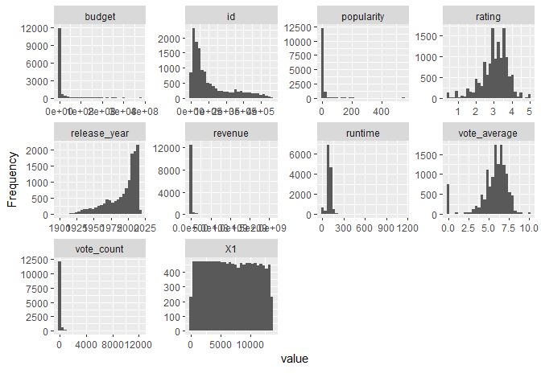<!-- -->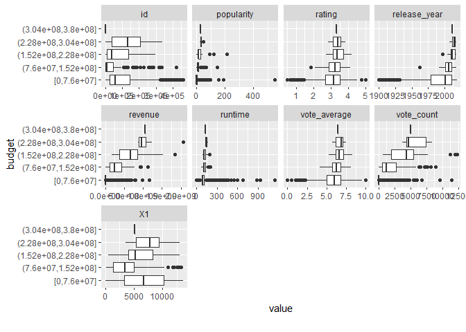<!-- -->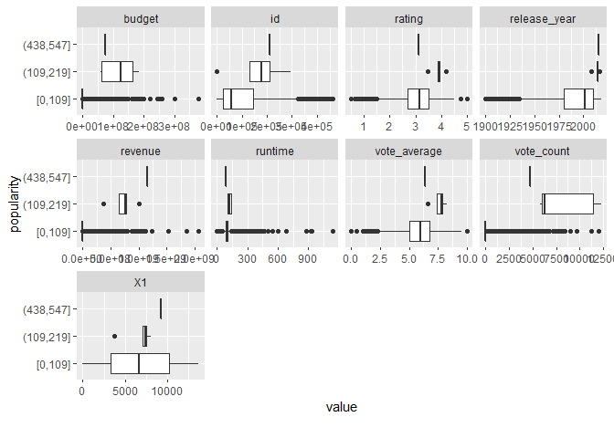<!-- -->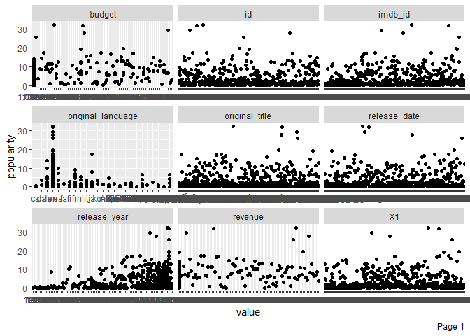<!-- -->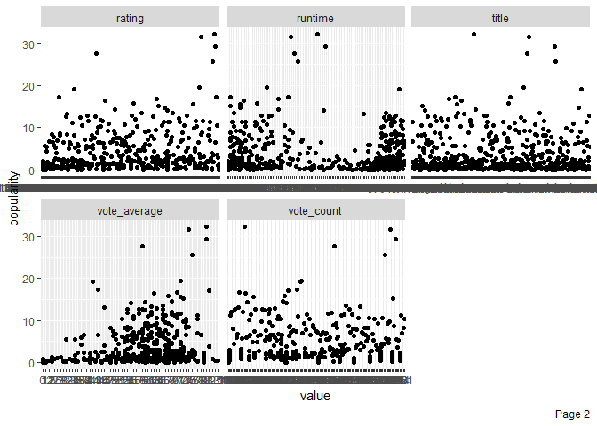<!-- -->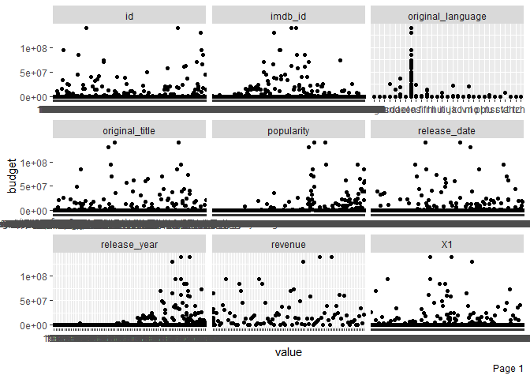<!-- -->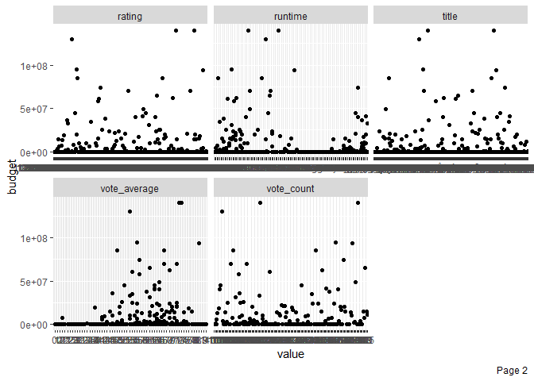<!-- -->

    ## Warning in dummify(data, maxcat = maxcat): Ignored all discrete features
    ## since `maxcat` set to 8 categories!

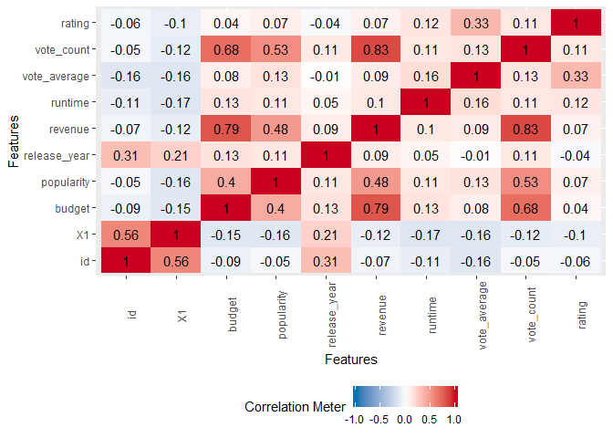<!-- -->

## 3\. Correlación entre dos variables

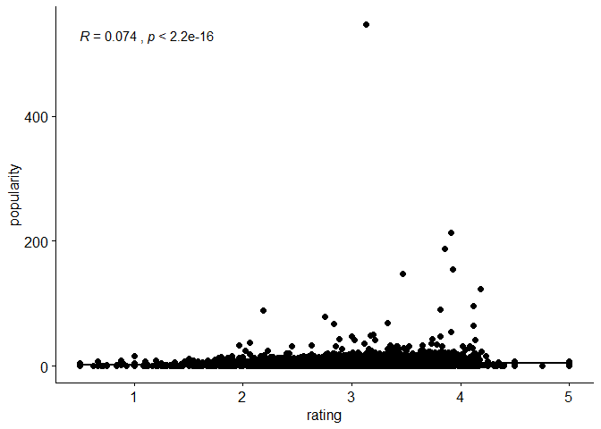<!-- -->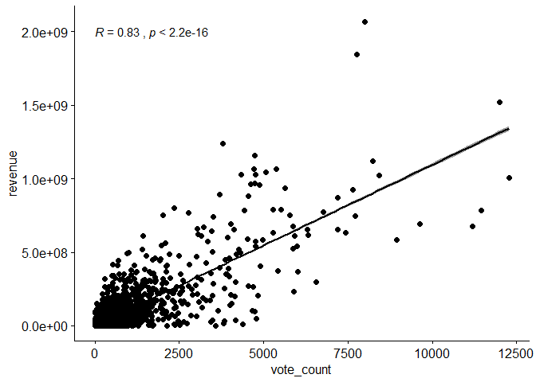<!-- -->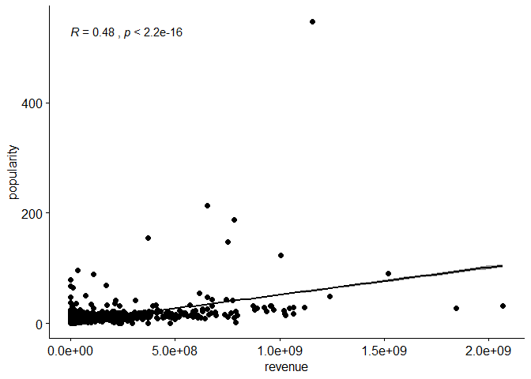<!-- -->

## 4\. Conclusiones

Muchos de los datos en la tabla tienen poca correlación y/o relevancia
para realizar un analísis. En los analísis realizados se pudieron notar
4 cosas importantes sobre los datos:

  - Los datos de rating de IMDB y los de los votos no tienen correlación
    o tienen un cociente de correlación muy bajo.

  - Curiosamente la cantidad de votos tiene correlación con el revenue
    generado por la película, mientras que la popularidad y el revenue
    están menos correlacionados.

  - Los ratings y la popularidad tienen una correlación baja.

  - Existen outliers extremos en la data como en el caso de la película
    Minions que es la película más popular por el momento.
